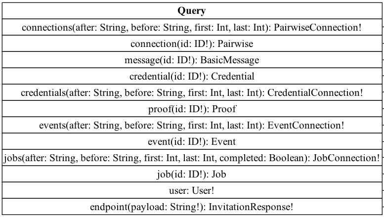

# findy-agent-vault

[](https://github.com/findy-network/findy-agent-vault/actions/workflows/test.yml)
[](https://codecov.io/gh/findy-network/findy-agent-vault)

> Findy Agency is an open-source project for a decentralized identity agency.
> OP Lab developed it from 2019 to 2024. The project is no longer maintained,
> but the work will continue with new goals and a new mission.
> Follow [the blog](https://findy-network.github.io/blog/) for updates.

## Getting Started

Findy Agency is a collection of services ([Core](https://github.com/findy-network/findy-agent),
[Auth](https://github.com/findy-network/findy-agent-auth),
[this service](https://github.com/findy-network/findy-agent-vault) and
[Web Wallet](https://github.com/findy-network/findy-wallet-pwa)) that provide
full SSI agency along with a web wallet for individuals.
To start experimenting with Findy Agency we recommend you to start with
[the documentation](https://findy-network.github.io/) and
[set up the agency to your localhost environment](https://github.com/findy-network/findy-wallet-pwa/tree/dev/tools/env#agency-setup-for-local-development).

- [Documentation](https://findy-network.github.io/)
- [Instructions for starting agency in Docker containers](https://github.com/findy-network/findy-wallet-pwa/tree/dev/tools/env#agency-setup-for-local-development)

## Project

Vault provides both

1. Data storage service for findy-agency clients
1. Abstraction/Convenience layer for [agency protocol APIs](github.com/findy-network/findy-agent-api) which can be used through GraphQL interface.

Vault provides currently only a GraphQL API but intends to support also GRPC in the future. As a findy-agency client you can use also the [findy-agent GRPC APIs](github.com/findy-network/findy-agent-api) directly, but will have to implement possible data storing and indexing capabilities yourself.


## API

The vault API is currently missing proper documentation, but you can figure out the functionality
from [the API schema](./schema/schema.graphqls).

Authentication is implemented with [agency-wide JWT token](./docs/README.md#cross-service-authentication).
You can generate a JWT token easily for your agent e.g. using [the CLI tool](https://github.com/findy-network/findy-agent-cli) or [web wallet](https://github.com/findy-network/findy-wallet-pwa) application.

Easiest is to start playing around with the queries:



- *connections* are the existing pairwise connections to other agents
- *messages* are sent and received messages through the Aries basic message protocol
- *credentials* are the credentials possessed by the holder (agent),
received through the Aries issue credential protocol
- *proofs* are the proofs sent by the holder (agent),
sent through the Aries present proof protocol
- *jobs* are differented Aries protocol flows the agent has participated in. Information from unfinished
connections, messages, credentials or proofs can be obtained through jobs.

The API pagination is implemented according to [GraphQL Cursor Connections Specification](https://relay.dev/graphql/connections.htm).

You can find the full schema diaram [here](./docs/gql_schema.png).

It is recommended to study [web wallet implementation](https://github.com/findy-network/findy-wallet-pwa) to understand more about the API features.

## Setup development environment

### Basic setup

1. [Install golang](https://golang.org/dl/)

1. Run app

   ```bash
   go run . version
   ```

   You shoud see something similar to this:

   ```bash
   I0526 14:43:44.750568   50912 config.go:68] Configuration file was not found, using environment/default variables only
   Vault version dev
   ```

### Service configuration

Vault cannot function without a working installation of [core agency](github.com/findy-network/findy-agent). Either setup core agency to your local machine or use agency installation in the cloud.

1. Vault can be configured using configuration file or environment variables. Following settings are required when running vault locally (note "<>" indicates example value, and should be replaced):

   ```bash
   # core agency address
   export FAV_AGENCY_HOST="<agency.example.com>"
   # core agency port
   export FAV_AGENCY_PORT="<50051>"
   # path to agency grpc cert files
   export FAV_AGENCY_CERT_PATH="<scripts/test-cert>"
   # true if this vault is the primary vault for the agency installation
   export FAV_AGENCY_MAIN_SUBSCRIBER=false
   # common agency JWT secret
   export FAV_JWT_KEY="<jwt-secret-common-with-core>"
   # vault database password (any password)
   export FAV_DB_PASSWORD="<password-for-postgres>"
   # vault server port
   export FAV_SERVER_PORT=8085
   # true if graphQL playground should be served in service root
   export FAV_USE_PLAYGROUND=true
   ```

1. Vault uses postgres to store its data. You can start postgres in a docker container:

   ```bash
   make db
   ```

1. Start vault by running the app with no arguments

   ```bash
   go run .
   ```

## Unit testing

Unit tests assume postgres is running on port 5433.

Launch default postgres container by declaring password for postgres user:

```bash
export FAV_DB_PASSWORD="mysecretpassword"
```

and running

```
make init-test
```

You can run all unit tests with command

```bash
go test ./...
```

For linting, you need to install [golangci-lint](https://golangci-lint.run/usage/install/#local-installation)

`make check` builds, tests and lints the code.

## Other documentation

Check [docs-folder](./docs/README.md)
